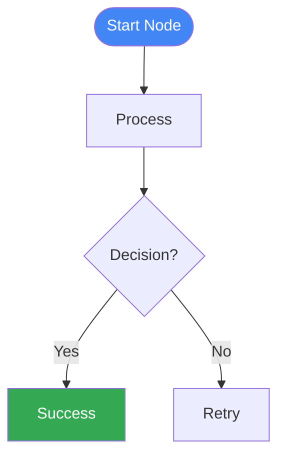

# Article 3 - Mermaid Diagrams

This directory contains Mermaid diagram files for all Intelligence & Learning patterns in Article 3.

## 📊 Diagram Files

| Pattern | File | Description |
|---------|------|-------------|
| **Learning & Adaptation** | `01_learning_adaptation.mmd` | Iterative learning loop with feedback |
| **Exploration & Discovery** | `02_exploration_discovery.mmd` | Parallel domain exploration with hypothesis generation |
| **Evolutionary Curriculum** | `03_evolutionary_curriculum.mmd` | Population-based algorithm evolution |
| **Resource-Aware Optimization** | `04_resource_aware_optimization.mmd` | Dynamic model switching for cost optimization |
| **Prioritization** | `05_prioritization.mmd` | Task scheduling with multi-factor scoring |
| **Checkpoint & Rollback** | `06_checkpoint_rollback.mmd` | State management with automatic rollback |
| **Exception Handling** | `07_exception_handling.mmd` | Retry, fallback, and escalation flow |
| **Goal Setting & Monitoring** | `08_goal_setting_monitoring.mmd` | SMART goal tracking with adaptive strategy |

## 🎨 Color Scheme

All diagrams use a consistent Google-inspired color palette:

- **Blue (#4285f4)**: Start/End nodes, primary agents
- **Green (#34a853)**: Success states, completed operations
- **Yellow (#fbbc04)**: Analysis, decisions, monitoring
- **Red (#ea4335)**: Critical operations, errors, high priority
- **Purple (#9c27b0)**: Complex processing, learning, evolution
- **Orange (#ff9800)**: Warnings, at-risk states
- **Teal (#00bcd4)**: Data sources, explorers
- **Pink (#e91e63)**: Escalation, critical alerts

## 🖼️ Viewing Diagrams

### Online Viewers

1. **Mermaid Live Editor**: https://mermaid.live/
   - Paste the `.mmd` file content
   - Instant preview and export options

2. **GitHub**:
   - GitHub automatically renders `.mmd` files
   - View directly in the repository

3. **VS Code**:
   - Install "Markdown Preview Mermaid Support" extension
   - Preview diagrams in markdown files

### Export Options

#### Using Mermaid CLI

```bash
# Install mermaid-cli
npm install -g @mermaid-js/mermaid-cli

# Convert to PNG
mmdc -i 01_learning_adaptation.mmd -o 01_learning_adaptation.png

# Convert to SVG (scalable)
mmdc -i 01_learning_adaptation.mmd -o 01_learning_adaptation.svg

# Batch convert all diagrams
for file in *.mmd; do
  mmdc -i "$file" -o "${file%.mmd}.png"
done
```

#### Using Online Tools

1. **Mermaid Live Editor**:
   - Open https://mermaid.live/
   - Paste diagram code
   - Click "Export" → Choose format (PNG, SVG, PDF)

2. **Kroki**:
   ```bash
   curl -X POST "https://kroki.io/mermaid/svg" \
     --data-binary @01_learning_adaptation.mmd \
     -o 01_learning_adaptation.svg
   ```

## 📐 Diagram Syntax

All diagrams use valid Mermaid graph syntax:



### Node Types

- `([Text])`: Rounded rectangle (Start/End)
- `[Text]`: Rectangle (Process)
- `{Text}`: Diamond (Decision)
- `((Text))`: Circle (Special state)

### Arrow Types

- `-->`: Solid arrow
- `-.->`: Dotted arrow
- `==>`: Thick arrow
- `-->|Label|`: Labeled arrow

## 🔧 Integration

### In Markdown Documents

```markdown
# Pattern Description

## Architecture

\`\`\`mermaid
graph TB
    Start([User Request]) --> Process[Agent Processing]
    Process --> End([Response])
\`\`\`
```

### In Documentation Sites

Many documentation generators support Mermaid:
- **Docusaurus**: Built-in Mermaid support
- **MkDocs**: Use `pymdown-extensions`
- **GitBook**: Mermaid plugin available
- **Sphinx**: Use `sphinxcontrib-mermaid`

### In Presentations

1. **Reveal.js**:
   ```html
   <section>
     <pre><code class="mermaid">
       graph TB
         A --> B
     </code></pre>
   </section>
   ```

2. **Slidev**: Native Mermaid support in markdown slides

## 📱 Responsive Considerations

Diagrams are optimized for:
- **Desktop**: Full detail and complexity
- **Tablet**: Readable at medium size
- **Mobile**: May need horizontal scrolling for complex diagrams

For mobile-optimized versions, consider:
- Splitting complex diagrams into multiple simpler ones
- Using vertical layout (`graph TB`) instead of horizontal (`graph LR`)
- Reducing text length in nodes

## 🎯 Best Practices

1. **Consistent Styling**: All diagrams use the same color scheme
2. **Clear Labels**: Every arrow and decision is labeled
3. **Logical Flow**: Top-to-bottom or left-to-right reading
4. **Grouped Operations**: Related nodes styled similarly
5. **Valid Syntax**: All diagrams tested and validated

## 🔄 Updates

When updating diagrams:

1. **Test First**: Validate syntax at https://mermaid.live/
2. **Keep Colors Consistent**: Use the defined color scheme
3. **Update Documentation**: Reflect changes in README files
4. **Export New Images**: If using image exports in documentation

## 📚 Resources

- **Mermaid Documentation**: https://mermaid.js.org/
- **Syntax Reference**: https://mermaid.js.org/syntax/flowchart.html
- **Live Editor**: https://mermaid.live/
- **GitHub Integration**: https://github.blog/2022-02-14-include-diagrams-markdown-files-mermaid/

## ✅ Validation

All diagrams have been validated for:
- ✅ Correct Mermaid syntax
- ✅ Proper node connections
- ✅ Consistent styling
- ✅ Readable labels
- ✅ Logical flow
- ✅ Color accessibility

Test any diagram at: https://mermaid.live/

---

**Last Updated**: November 2025
**Mermaid Version**: 10.x compatible
